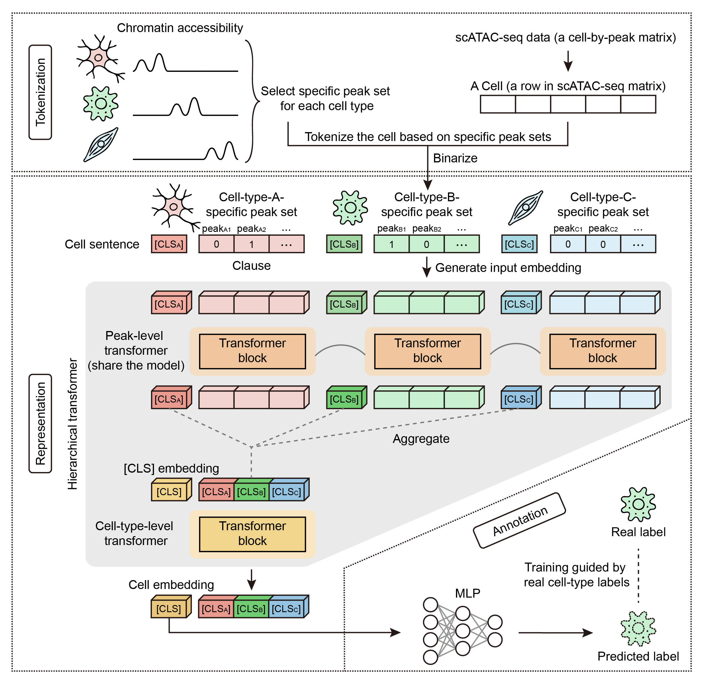

# HitAnno
This repository contains the official implementation of the paper: 
**HitAnno: Atlas-level cell type annotation based on scATAC-seq data via a hierarchical language model.**

Table of Contents:
- [Overview](#Overview)
- [Installation](#Installation)
- [Usage](#Usage)
- [Tutorial](#Tutorial)
- [Citation](#Citation)
- [License](#License)

## Overview
We developed HitAnno, a hierarchical language model based on transformer architecture capable of atlas-level cell type annotation on scATAC-seq data. HitAnno represents each cell as a structured “cell sentence”, constructed from accessibility profiles on specific peaks with consideration of both major and rare cell types. Based on cell sentences, HitAnno employs a two-level attention mechanism that integrates accessibility profiles from individual peaks to higher-order peak sets, enabling scalable extraction of cell-type-specific patterns while explicitly capturing peak interactions at hierarchical levels.

<div align="center">
  
</div>

## Installation
We recommend creating a new virtual environment to ensure compatibility:
```bash
conda create -n hitanno python=3.9
conda activate hitanno
```
Install core computation and plotting libraries:
```bash
conda install numpy==1.26.4 pandas==2.2.2 scipy==1.13.0
conda install seaborn==0.13.2
```
Install PyTorch with CUDA support. The following command assumes a GPU compatible with CUDA 11.8:
```bash
conda install pytorch==2.0.0 torchvision==0.15.0 torchaudio==2.0.0 pytorch-cuda=11.8 -c pytorch -c nvidia
```
Install libraries required for data I/O, analysis, and modeling:
```bash
pip install hdf5storage==0.1.19
pip install scanpy==1.10.1
pip install transformers==4.40.1
```
Install FlashAttention. Refer to the [FlashAttention installation guide](https://github.com/Dao-AILab/flash-attention#installation) for details:
```bash
pip install flash-attn==2.5.8 --no-build-isolation
```
(Optional) If you use Jupyter Notebooks, register the environment kernel:
```bash
pip install ipykernel
python -m ipykernel install --user --name=hitanno
```

## Usage
After setting up the environment and downloading the code, you can run the program with Python to perform prediction. We provide a `run_hitanno_test.py` file, where you can use `-h` to view all parameters and their detailed descriptions.
```
usage: run_hitanno_test.py [-h] [--train_data TRAIN_DATA] [--test_data TEST_DATA] [--peak_num_ct PEAK_NUM_CT] [--output_path OUTPUT_PATH]

optional arguments:
  -h, --help            show this help message and exit
  --train_data TRAIN_DATA
                        Path to training dataset (h5ad file)
  --test_data TEST_DATA
                        Path to test dataset (h5ad file)
  --peak_num_ct PEAK_NUM_CT
                        Peak number per cell type (the default parameters are set for a 24 GB GPU and can be adjusted dynamically according to the available memory)
  --output_path OUTPUT_PATH
                        Path of outputs
```
We provide an example for testing. After downloading the [Domcke2020_adrenal_mini](https://drive.google.com/drive/folders/1R2vfJNoVwj-v0AXjIxp3R1Ul-aOcORsi?usp=share_link) dataset and placing it in a newly created `./data/` directory, you can run the following command to train and evaluate the HitAnno model. The prediction results will be saved in the `./outputs/` directory:
```bash
python run_hitanno.py --train_data ./data/Domcke2020_adrenal_mini_train.h5ad --test_data ./data/Domcke2020_adrenal_mini_test.h5ad --output_path ./outputs/
```

## Tutorial
After downloading the [Domcke2020_adrenal_mini](https://drive.google.com/drive/folders/1R2vfJNoVwj-v0AXjIxp3R1Ul-aOcORsi?usp=share_link) dataset and placing it in a newly created `./data/` directory, you can refer to the `HitAnno_demo.ipynb` file to know more about how to use the HitAnno interface for model training and prediction.

## Citation
*Coming soon*

## License
This project is covered under the MIT license.
