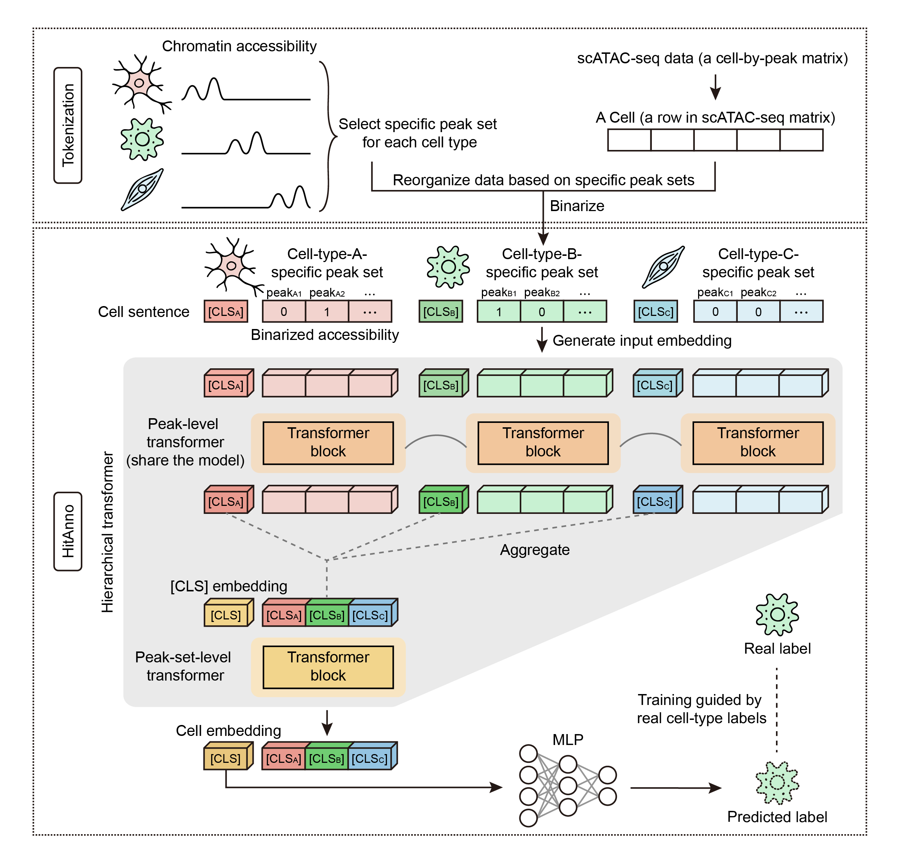

# HitAnno
This repository contains the official implementation of the paper: 
**HitAnno: a hierarchical transformer for cell type annotation on scATAC-seq data.**

Table of Contents:
- [Overview](#Overview)
- [Installation](#Installation)
- [Usage](#Usage)
- [Tutorial](#Tutorial)
- [Citation](#Citation)
- [License](#License)

## Overview
We developed HitAnno, a scalable model built on a hierarchical transformer architecture for accurate cell type annotation on large scATAC-seq datasets. HitAnno constructs “cell sentences” by leveraging accessibility profiles on cell-type-specific peaks, capturing the epigenomic cell heterogeneity. The model adopts a two-level attention mechanism to capture both peak-level and peak-set-level dependencies, enabling hierarchical feature integration for reliable annotation performance.

  

## Installation
*under construction*

## Usage
*under construction*

## Tutorial
*under construction*

## Citation
*Coming soon*

## License
This project is covered under the MIT license.
